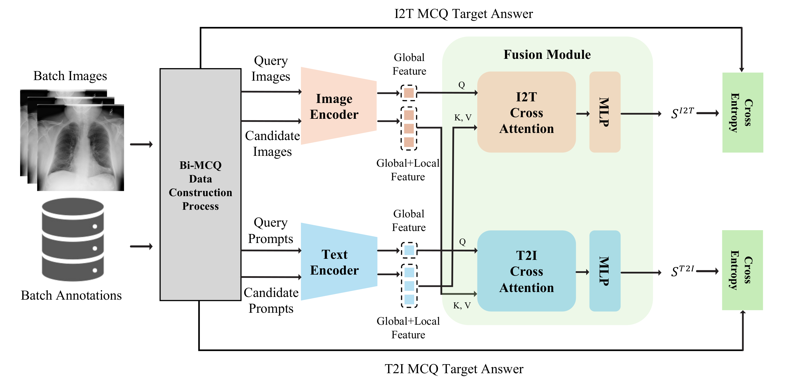
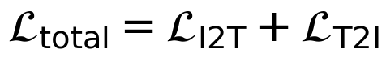

# Bi-MCQ

**Bi-MCQ: Reformulating Vision–Language Alignment for Negation Understanding**

*Tae Hun Kim, Hyun Gyu Lee — Inha University | ICPR 2026*

---

## Overview



Vision–language models (VLMs) pretrained on large-scale image–text pairs achieve strong zero-shot performance in medical image analysis, but they remain notably weak at understanding **negated clinical statements** ("There is no Atelectasis"), largely because contrastive alignment objectives (InfoNCE) treat negation as a minor linguistic variation rather than a meaning-inverting operator. In multi-label chest X-ray settings, this is compounded by an abundance of easy-positive image/negative-prompt pairs, which reinforces low-information alignment and limits effective learning of disease *absence*.

**Bi-MCQ** reformulates vision–language fine-tuning as a **conditional semantic comparison problem** rather than global similarity maximization, instantiated through a bi-directional multiple-choice question (MCQ) framework:

- **Image-to-Text (I2T) MCQ** — for each image, the model must pick the text (affirmative / negative / mixed) that is semantically consistent with the ground-truth annotation among several candidate prompts.
- **Text-to-Image (T2I) MCQ** — for each affirmative/negative/mixed query prompt, the model must pick the correct image among candidates drawn from the batch.
- **Direction-specific Cross-Attention fusion modules** — separate I2T and T2I cross-attention heads prevent representational interference between the two alignment directions.

On ChestXray14, Open-I, CheXpert, and PadChest, Bi-MCQ improves negation understanding by up to **0.47 AUC** over zero-shot performance, gains up to **0.08** absolute AUC on Positive–Negative Combined (PNC) evaluation, and reduces the affirmative–negative AUC gap by an average of **0.12** compared to InfoNCE-based fine-tuning.

This repository implements Bi-MCQ-fine-tuning and evaluation for three medical VLM backbones: **CARZero** (ViT-B/16 + BioClinicalMPBERT), **MedKLIP** (ResNet-50 + ClinicalBERT), and **KAD** (ResNet-50 + PubMedBERT).

---

## Architecture

For a query image (I2T) or query prompt (T2I), the backbone's image encoder
<picture><source media="(prefers-color-scheme: dark)" srcset="assets/eq_fimg_dark.png"></picture>
and text encoder
<picture><source media="(prefers-color-scheme: dark)" srcset="assets/eq_ftxt_dark.png"></picture>
produce global + local embeddings for the query and its MCQ candidates. A **direction-specific cross-attention fusion module** then aggregates candidate information under the query condition:

- **I2T:** query = image global embedding, key/value = candidate text (global + local) embeddings → matching logit per text candidate.
- **T2I:** query = text global embedding, key/value = candidate image (global + local) embeddings → matching logit per image candidate.

Both directions are optimized jointly with cross-entropy over their respective candidate sets
(<picture><source media="(prefers-color-scheme: dark)" srcset="assets/eq_loss_dark.png"></picture>),
backpropagated through **separate** I2T/T2I fusion modules so the two directions don't interfere with each other's representations (see the framework diagram above).

**Supported backbones:**

| Backbone | Image Encoder | Text Encoder |
|---|---|---|
| CARZero | ViT-B/16 | BioClinicalMPBERT |
| MedKLIP | ResNet-50 | ClinicalBERT |
| KAD | ResNet-50 | PubMedBERT |

---

## Experiments

### Cross-Dataset Generalization (Table 1)

Zero-shot vs. Bi-MCQ-fine-tuned performance (POS / NEG / PNC AUC) across all three backbones. Bi-MCQ-fine-tuning is performed only on ChestXray14; Open-I, CheXpert, and PadChest are held out as external test sets.

| | | ChestXray14 | | | Open-I | | | CheXpert | | | PadChest | |
|---|---|---|---|---|---|---|---|---|---|---|---|---|
| **Model** | **Setting** | POS | NEG | PNC | POS | NEG | PNC | POS | NEG | PNC | POS | NEG | PNC |
| CARZero | Zero-shot | 0.811 | 0.429 | 0.773 | 0.861 | 0.393 | 0.842 | 0.923 | 0.491 | 0.903 | 0.799 | 0.393 | 0.810 |
| CARZero | **Bi-MCQ** | **0.851** | **0.836** | **0.849** | 0.858 | **0.859** | **0.859** | 0.896 | **0.896** | **0.898** | **0.833** | **0.811** | **0.825** |
| MedKLIP | Zero-shot | 0.687 | 0.340 | 0.562 | 0.738 | 0.313 | 0.593 | 0.781 | 0.275 | 0.574 | **0.515** | 0.480 | **0.533** |
| MedKLIP | **Bi-MCQ** | **0.822** | **0.822** | **0.825** | **0.776** | **0.773** | **0.777** | **0.770** | **0.762** | **0.768** | 0.484 | **0.490** | 0.489 |
| KAD | Zero-shot | 0.788 | 0.242 | 0.602 | **0.835** | 0.180 | 0.602 | 0.762 | 0.239 | 0.590 | 0.513 | **0.470** | 0.452 |
| KAD | **Bi-MCQ** | **0.826** | **0.822** | **0.827** | 0.789 | **0.776** | **0.785** | **0.771** | **0.752** | **0.762** | **0.526** | 0.451 | 0.451 |

**Key findings:**
- All three backbones show strong zero-shot POS performance but near-chance NEG performance — zero-shot predictions rely largely on surface-level disease-name matching rather than negation-aware reasoning.
- Bi-MCQ-fine-tuning consistently closes the POS/NEG gap and improves PNC across ChestXray14, Open-I, and CheXpert, with the largest gains in-domain on ChestXray14.
- Gains on PadChest are limited, reflecting domain mismatch between ChestXray14 (the fine-tuning source) and PadChest's label/imaging distribution.
---

## Repository Structure

```
Bi-MCQ/
├── CARZero/                      # CARZero/BiMCQ model package (encoders, fusion modules, builder)
├── finetune/
│   ├── train_carzero.py          # Bi-MCQ fine-tuning — CARZero backbone
│   ├── train_medklip.py          # Bi-MCQ fine-tuning — MedKLIP backbone
│   ├── train_kad.py              # Bi-MCQ fine-tuning — KAD backbone
│   ├── models.py                 # LightningModules + backbones (BiMCQCARZeroModule,
│   │                              #   BiMCQMedKLIPModule/BiMCQMedKLIP, BiMCQKADModule/BiMCQKAD)
│   ├── datamodules.py / datasets.py  # NIH ChestXray14 MCQ DataModule/Dataset
│   └── utils.py                  # MCQ batch construction (generate_mcq, build_t2i_mcq_batch, ...)
├── inference/
│   ├── common.py                 # Shared function
│   ├── utils.py                  # Shared utilities
│   ├── CARZero/                  # CARZero backbone.py + Inference code
│   ├── MedKLIP/                  # MedKLIP backbone.py + Inference code
│   └── KAD/                      # KAD backbone.py + Inference code
├── configs/
│   ├── chest14_finetuning_Bi-MCQ.yaml    # CARZero backbone config
│   ├── chest14_finetuning_MedKLIP.yaml   # MedKLIP backbone config
│   └── chest14_finetuning_KAD.yaml       # KAD backbone config
├── pretrain_model/                # Pretrained backbone weights (download separately)
│   ├── CARZero_best_model.ckpt
│   ├── MedKLIP_checkpoint_final.pth
│   ├── KAD_image_best_valid.pt
│   └── KAD_text_epoch_latest.pt
├── checkpoints/                   # Bi-MCQ fine-tuned checkpoints, one per backbone
│   ├── BiMCQ_CARZero_best_model.ckpt
│   ├── BiMCQ_MedKLIP_best_model.ckpt
│   └── BiMCQ_KAD_best_model.ckpt
├── ChestXray-14/test_list.txt      # Official NIH test split
├── Chexpert/                       # CheXpert5 test image list + labels
├── PadChest/                       # PadChest test image list + manual labels
├── train.sh                        # Fine-tune a chosen backbone
├── inference.sh                    # Evaluate a chosen backbone on all 4 datasets
└── results/                        # <save_dir>/<model>/<dataset>/<timestamp>/ evaluation outputs
```

---

## Dataset

[NIH ChestXray-14](https://nihcc.app.box.com/v/ChestXray-NIHCC) is the only dataset used for Bi-MCQ-fine-tuning, and also serves as the in-domain benchmark. Open-I, CheXpert, and PadChest are used only as external, held-out test sets.

| Split / Dataset | Size | Notes |
|---|---|---|
| [ChestXray14](https://nihcc.app.box.com/v/ChestXray-NIHCC) Train | 80,718 | All images not in `test_list.txt` (90%) |
| [ChestXray14](https://nihcc.app.box.com/v/ChestXray-NIHCC) Val | 8,969 | Random 10% of training images |
| [ChestXray14](https://nihcc.app.box.com/v/ChestXray-NIHCC) Test | 22,433 | Official `ChestXray-14/test_list.txt`, 14 disease labels |
| [Open-I](https://openi.nlm.nih.gov/faq) (external) | — | Same 14 disease labels as ChestXray14 |
| [CheXpert](https://stanfordmlgroup.github.io/competitions/chexpert/) (external) | — | 5 major observation categories |
| [PadChest](https://bimcv.cipf.es/bimcv-projects/padchest/) (external) | — | 5 shared disease labels, expert-verified manual annotations only |

**Disease categories (ChestXray14 / Open-I):** Atelectasis, Cardiomegaly, Effusion, Infiltration, Mass, Nodule, Pneumonia, Pneumothorax, Consolidation, Edema, Emphysema, Fibrosis, Pleural Thickening, Hernia, No Finding

### Required File Structure

```
{data_path}/                        # e.g. ./../data/NIH, passed implicitly via each script's DATA_PATH
├── Data_Entry_2017.csv             # label file (training only)
└── images*/
    └── images/
        └── *.png                   # chest X-ray images

ChestXray-14/test_list.txt          # fixed path at project root (train + inference)
Chexpert/{chexpert5_test_image.csv, test_labels.csv}
PadChest/{padchest_multi_label_image.csv, manual_image.json}
```

These label/test-split files (plus a few extra metadata files) are hosted on this shared [Google Drive folder](https://drive.google.com/drive/folders/1gOcT85z7il9JmD_1t_QwXC5EQpJNpUhb):

| Dataset | Folder | Files |
|---|---|---|
| ChestXray-14 | [Google Drive](https://drive.google.com/drive/folders/1CXlzYND8DNy5uw0FATYXZmZEBia0Owwr) | `test_list.txt`, `chestxray14_test_image.csv`, `chestxray14_test_text.json`, `miccai2023_nih-cxr-lt_labels_test.csv` |
| CheXpert | [Google Drive](https://drive.google.com/drive/folders/1wwYbJ6_NDUZ26DKPfG7YAE5v7E3mXHB7) | `chexpert5_test_image.csv`, `test_labels.csv` |
| OPEN-I | [Google Drive](https://drive.google.com/drive/folders/1UxdANwKmizv1tYwc_BemOLp-ten5sq98) | `custom.csv` |
| PadChest | [Google Drive](https://drive.google.com/drive/folders/1pYzegpJ4AhGj0InkeelpgFjuoxxSgcqe) | `padchest_multi_label_image.csv`, `manual_image.json` |

---

## Installation

```bash
git clone https://github.com/Castella99/Bi-MCQ
cd Bi-MCQ

pip install -r requirements.txt
```

### Pretrained Backbone Weights

Place the following under `pretrain_model/` (used to initialize each backbone before Bi-MCQ fine-tuning):

| File | Backbone | Source |
|---|---|---|
| `CARZero_best_model.ckpt` | CARZero | [Google Drive](https://drive.google.com/file/d/1kYF-k5otW5DHwz1En5d_ScV3zu2E27Ch/view?usp=sharing) |
| `MedKLIP_checkpoint_final.pth` | MedKLIP image/text encoders | [Google Drive](https://drive.google.com/drive/folders/1HBShH7J_pO8onkzuweDgDq2QPqj6zjG_?usp=sharing) |
| `KAD_image_best_valid.pt` | KAD image encoder | [Google Drive](https://drive.google.com/drive/folders/1QKO_4I4yWQuhOMh-X8hc_ZdcoQpEGd4d) |
| `KAD_text_epoch_latest.pt` | KAD text encoder | [Google Drive](https://drive.google.com/drive/folders/1NjDPllwATZ-WKUQlfyPiqDkG64et1ICL) |

### Fine-tuned Bi-MCQ Weights

Place the fine-tuned checkpoint for the backbone(s) you want to run inference with under `checkpoints/`:

| File | Backbone | Source |
|---|---|---|
| `BiMCQ_CARZero_best_model.ckpt` | CARZero | [Google Drive](https://drive.google.com/file/d/1uLHWAseDQn6g6MhW4KLUNwVP1DrhyJqc/view?usp=sharing) |
| `BiMCQ_MedKLIP_best_model.ckpt` | MedKLIP | [Google Drive](https://drive.google.com/file/d/1S6hpF7XPyeoXrf5RryGTMAbyGW31c1a9/view?usp=sharing) |
| `BiMCQ_KAD_best_model.ckpt` | KAD | [Google Drive](https://drive.google.com/file/d/1YLQh2DFCPCps30r8iEhbiI0TxKoKRJFa/view?usp=sharing) |

---

## Usage

### Training

```bash
./train.sh              # CARZero (default)
./train.sh MedKLIP
./train.sh KAD
```

Each backbone's config path (`configs/chest14_finetuning_{Bi-MCQ,MedKLIP,KAD}.yaml`) is hardcoded inside its own `finetune/train_<model>.py`, so training doesn't take CLI arguments — edit the config or the script directly for a different setup. Equivalent direct call:

```bash
python finetune/train_carzero.py
```

### Inference

```bash
./inference.sh                       # CARZero (default), all 4 datasets
./inference.sh MedKLIP
./inference.sh KAD
./inference.sh CARZero configs/chest14_finetuning_Bi-MCQ.yaml checkpoints/BiMCQ_CARZero_best_model.ckpt results 64
```

| Positional arg | Default | Description |
|---|---|---|
| 1. model | `CARZero` | `CARZero` \| `MedKLIP` \| `KAD` |
| 2. cfg_path | backbone default | Path to the model's `config.yaml` |
| 3. ckpt_path | backbone default | Fine-tuned Bi-MCQ checkpoint |
| 4. save_dir | `results` | Base output directory |
| 5. batch_size | `64` | Inference batch size |

Or run a single dataset directly:

```bash
python inference/CARZero/Inference_NIH14.py \
    --cfg_path   configs/chest14_finetuning_Bi-MCQ.yaml \
    --ckpt_path  checkpoints/BiMCQ_CARZero_best_model.ckpt \
    --save_dir   results \
    --batch_size 64 \
    --directional=True   # CARZero only; also enables --tsne=True
```

`--directional`/`--tsne` compute additional I2T/T2I-direction metrics and t-SNE plots; they're only available for the CARZero backbone (MedKLIP/KAD don't expose per-direction features). Each run writes to `results/<model>/<dataset>/<timestamp>/`, with a matching `inference.log` alongside the CSV/`.npy` outputs.

**Output:** Positive, Negative, and PNC AUROC/F1/MCC tables per disease, saved as `{prefix}_{pos,neg,pnc}_results.csv`.

---

## Evaluation Metrics

| Metric | Description |
|---|---|
| **AUC** | Area under the ROC curve — robust to class imbalance |
| **F1** | Harmonic mean of precision/recall at the best-F1 threshold |
| **MCC** | Matthews Correlation Coefficient — balanced measure using all four confusion-matrix cells |
| **PNC** | Positive–Negative Combined: softmax over the (positive, negative)-prompt logit pair, predicting disease presence vs. absence directly |

---

## Configuration

Key parameters shared across `configs/chest14_finetuning_{Bi-MCQ,MedKLIP,KAD}.yaml`:

| Parameter | Default | Description |
|---|---|---|
| `train.batch_size` | `16` | Training batch size |
| `train.loss_weight` | `0.5` | I2T vs. T2I loss weighting |
| `train.seed` | `14` | Random seed |
| `lightning.trainer.lr` | `1e-5` | Adam learning rate |
| `lightning.trainer.precision` | `16-mixed` | Mixed-precision training |
| `model.{CARZero,MedKLIP,KAD}.single_path` | `true` | Use only one MCQ direction's logits for the final prediction |
| `freeze.image/text/fusion` | `false` | Modules to freeze during fine-tuning |

---

## Acknowledgments

This work builds upon three medical vision–language backbones:

- [CARZero](https://github.com/laihaoran/CARZero) — Cross-Attention Alignment for Radiology Zero-Shot Classification (Lai et al., CVPR 2024).
- [MedKLIP](https://github.com/MediaBrain-SJTU/MedKLIP) — Medical Knowledge Enhanced Language-Image Pre-training (Wu et al., ICCV 2023)
- [KAD](https://github.com/xiaoman-zhang/KAD) — Knowledge-Enhanced Auto Diagnosis (Zhang et al., Nature Communications 2023)

We gratefully acknowledge the authors of these works for releasing their code and pretrained weights.
